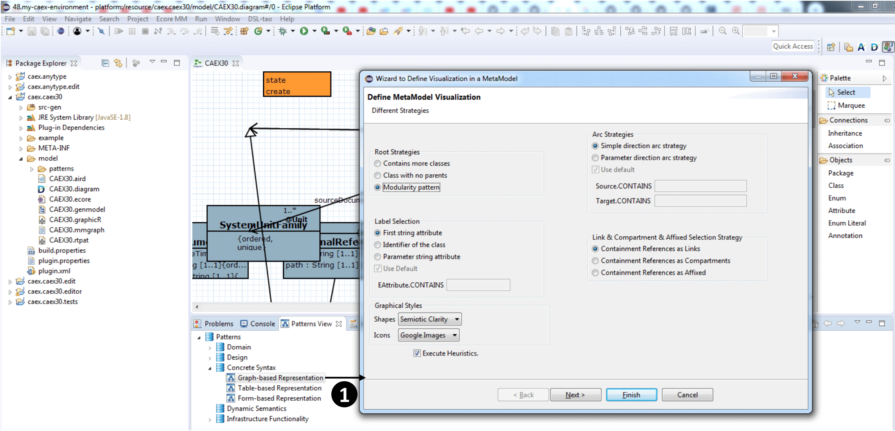

### Develop an environment for CAEX using EMF-Splitter and EMF-Stencil

In order to create an environment for the CAEX, we base on the Github repository [https://github.com/amlModeling/](https://github.com/amlModeling/). We import all the projects in an Eclipse workspace. 

1. The first step to create the scalable environment is the application of the fragmentation strategy. The following image shows how to do it using the DSL-tao plug-in through the "Patterns View", double clicking on "Modularity" (label 1).

    We use the dedicated wizard to apply the fragmentation strategy shown in the following image:

    

    __First page of the wizard__ 
    
    __Second page of the wizard__: to define the _Project_ class 
    
    __Third page of the wizard__: permits the definition of objects of type _Package_ and _Unit_ 
    

    Clicking on the _Finish_ button to apply the fragmentation pattern.

2. The next step required to create a graphical environment is to assign a concrete syntax. To do this, we are going to use the EMF-Stencil dedicated wizard. Using the "Patterns View" provided by DSL-tao, double click on "Graph-based representation" (label 1).

    __First page of the wizard to assign a concrete syntax__: offers several heuristics that the DSL designer can select to produce a default representation.
    
    __Second page of the wizard to assign a concrete syntax__: to customize the mapping between the elements as node-like and edge-like. Besides, allows the customization of the palette.
    
    concrete-syntax-emf-stencil-2

3. The third step consist in generate the Eclipse plug-ins using the information of the attached patterns.

### Stand-alone

In this example, we use DSL-tao as a front-end. In case you do not want to use DSL-tao, you can access the functionalities of EMF-Splitter and EMF-Stencil right clicking on the ecore model -> EMF-Splitter and EMF-Stencil. 

__Define Pattern__ the menu to attach the patterns and the graphical style to the meta-model

__Create Plugin__ to generate the Eclipse plug-in from the attached patterns 

