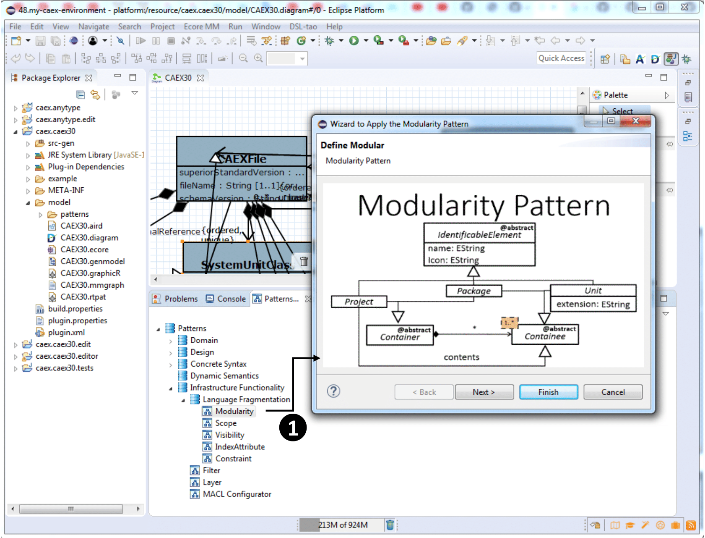

### Develop an environment for CAEX using EMF-Splitter and EMF-Stencil

In order to create an environment for the CAEX, we base on the Github repository [https://github.com/amlModeling/](https://github.com/amlModeling/). We import all the projects in an Eclipse workspace. The first step to create the scalable environment is the application of the fragmentation strategy. The following image shows how to do it using the DSL-tao plug-in through the "Patterns View", double clickin on "Modularity" (label 1).

