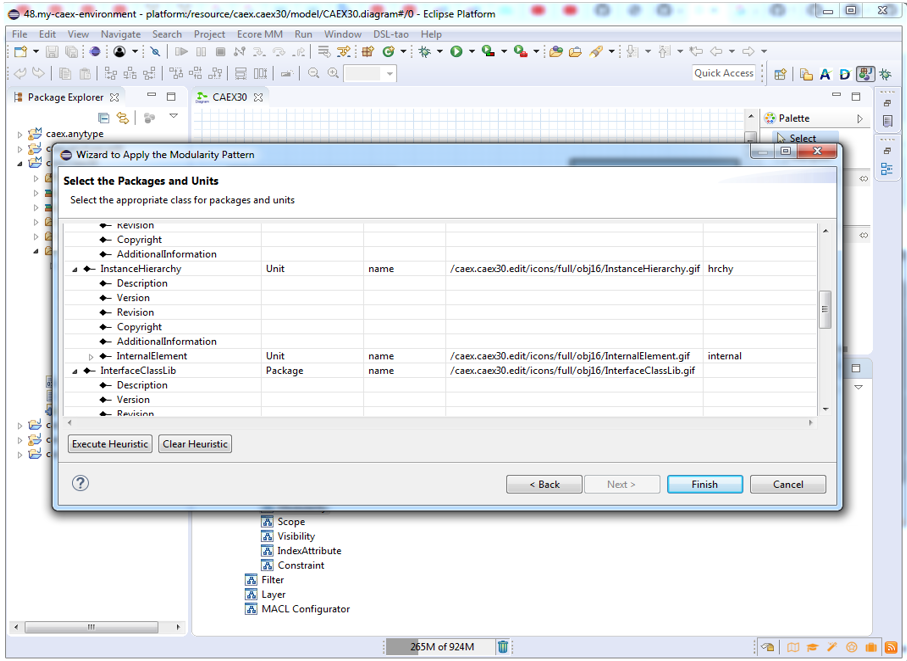

### Develop an environment for CAEX using EMF-Splitter and EMF-Stencil

In order to create an environment for the CAEX, we base on the Github repository [https://github.com/amlModeling/](https://github.com/amlModeling/). We import all the projects in an Eclipse workspace. The first step to create the scalable environment is the application of the fragmentation strategy. The following image shows how to do it using the DSL-tao plug-in through the "Patterns View", double clicking on "Modularity" (label 1).

__First page of the wizard__

__Second page of the wizard__

__Third page of the wizard__

### Stand-alone

In this example, we use DSL-tao as a front-end. In case you do not want to use DSL-tao, you can access the functionalities of EMF-Splitter and EMF-Stencil right clicking on the ecore model -> EMF-Splitter and EMF-Stencil. 

__Define Pattern__ the menu to attach the patterns and the graphical style to the meta-model

__Create Plugin__ to generate the Eclipse plug-in from the attached patterns 

