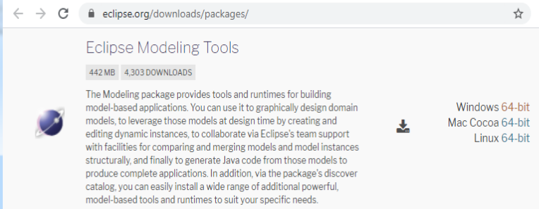
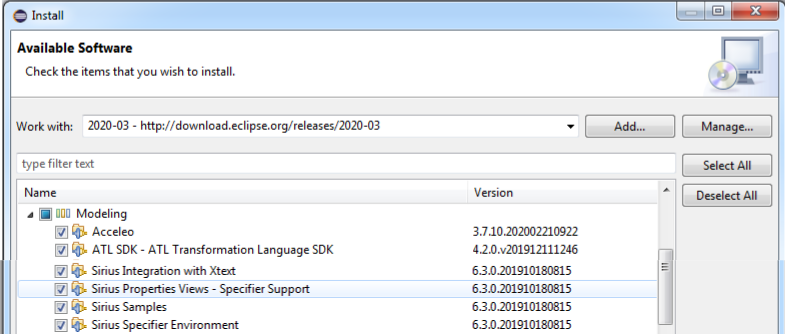

### Installation Manual

__1. Download Eclipse__: [https://www.eclipse.org/downloads/packages/](https://www.eclipse.org/downloads/packages/) 

__2. Install Acceleo, ATL, Sirius__:
__Update site__: [http://download.eclipse.org/releases/2020-03](http://download.eclipse.org/releases/2020-03) 

__3. Install Epsilon__:
__Update site__: [https://download.eclipse.org/epsilon/updates/](https://download.eclipse.org/epsilon/updates/) 

__4. Install DSL-tao__:
__Update site__: [http://jdelara.github.io/DSL-tao/update-site/](http://jdelara.github.io/DSL-tao/update-site/) 

Finally, Install EMFStencil
__Update site__: [https://antoniogarmendia.github.io/emfsplitter/](https://antoniogarmendia.github.io/emfsplitter/) 